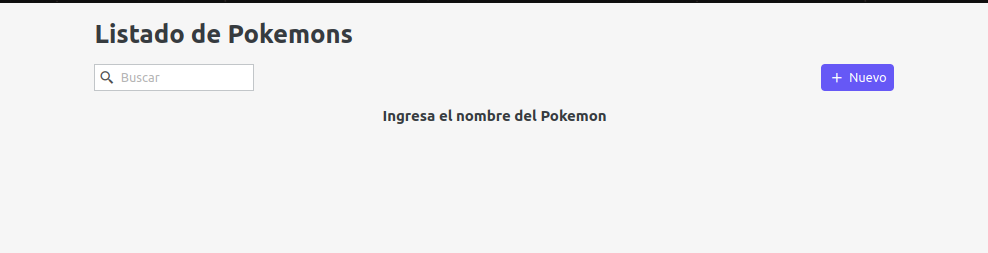
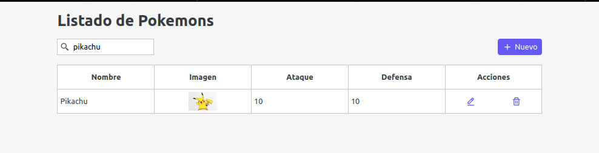
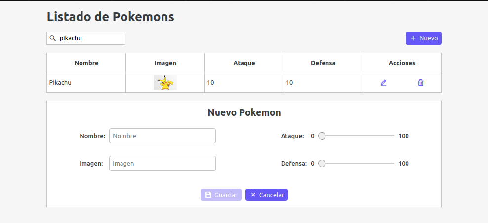
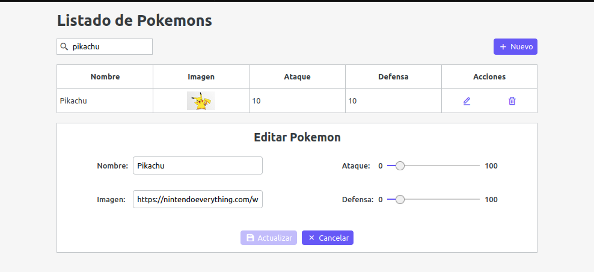

# DEVSU

## Aplicación de [Pokemons](https://github.com/norbix14/devsu-challenge-pokemons "Proyecto en GitHub")

## Screenshots

### Maqueta o modelo de la aplicación


### Desafío






## Ejecutar la aplicación

### Clonar repositorio

* usando `gh-cli`

  ```bash
    gh repo clone norbix14/devsu-challenge-pokemons pokemons
  ```

* usando `git`

  ```bash
    git clone https://github.com/norbix14/devsu-challenge-pokemons.git pokemons
  ```

### Instalar dependencias

  ```bash
    cd pokemons
    npm install
  ```

### Ejecutar

  ```bash
    npm run dev
  ```

### Visualizar

* Abrir navegador en [localhost](http://localhost:3000 "puerto 3000")
* `Nota: al día Lunes 13 de Junio de 2022 alrededor del mediodía (hora de Argentina), el` [backend](https://pokemon-pichincha.herokuapp.com/pokemons "backend") `dejó de funcionar.`
