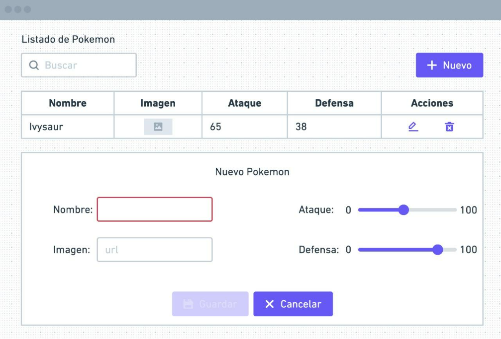

# DEVSU

## Aplicación de [Pokemons](https://github.com/norbix14/devsu-challenge-pokemons "Proyecto en GitHub")

## Screenshots

### Maqueta o modelo de la aplicación



### Desafío


## Ejecutar la aplicación

### Clonar repositorio

* usando `gh-cli`

  ```bash
    gh repo clone norbix14/devsu-challenge-pokemons pokemons
  ```

* usando `git`

  ```bash
    git clone https://github.com/norbix14/devsu-challenge-pokemons.git pokemons
  ```

### Instalar dependencias

  ```bash
    cd pokemons
    npm install
  ```

### Ejecutar aplicación

  ```bash
    npm run dev
  ```

### Ejecutar tests

  ```bash
    npm run test
  ```

### Visualizar

* Abrir navegador en [localhost](http://localhost:3000 "puerto 3000")
